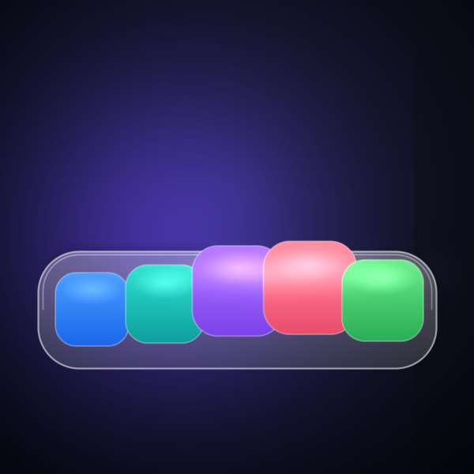

# Liquid Glass — After Effects scripts

Two ExtendScripts, each building a 300 × 300 comp **entirely from code**:

| Script                  | What it builds                                                          |
|-------------------------|-------------------------------------------------------------------------|
| `LiquidGlassLens.jsx`   | **The refractive lens** — a draggable glass orb that magnifies/refracts the scene behind it (Bulge + circle matte), with specular rim, chromatic fringe and drop shadow. *This is the "liquid glass" lens effect.* |
| `LiquidGlassDock.jsx`   | A frosted glass **dock** of buttons with macOS-style magnification.     |

Run either via `File › Scripts › Run Script File…`. Both ship with an auto-demo
and a draggable control null (set the demo/float slider to 0 to drive by hand).

### `LiquidGlassLens.jsx` — how the refraction works
- A second copy of the scene gets the **Bulge** effect (magnify + edge bend),
  clipped to a circle via an alpha **track matte** that follows the `Lens` null.
- The glass surface (drop shadow, chromatic-fringe rings, milky frost, bright
  rim, inner contact shadow, specular crescent + sparkle) is built from shape
  layers parented to the `Lens` null.
- `Controls` null sliders: **Magnify** (bulge), **Radius** (lens size),
  **Fringe** (chromatic offset), **Float** (1 = auto drift, 0 = manual drag).
- Drive it: select `Controls`, set `Float` = 0, drag the `Lens` null.

> A genuinely interactive, verifiable web version of this same lens lives in
> `../liquid-glass/` (open `index.html`).

---

## LiquidGlassDock.jsx

A 300 × 300 composition that recreates Apple's *Liquid Glass* look as an
interactive dock of buttons.



*(Above: a still rendered by `render_preview.js` — a dependency-free Node
rasterizer that previews the exact design without opening After Effects.)*

## What it is

A frosted glass slab floating over a soft, color-shifting background, holding a
row of 5 rounded app buttons. Slide a "finger" across it and the buttons
**magnify and lift** (macOS-dock style) while a **specular sheen** tracks the
cursor and the **frosted backdrop** refracts the colors behind the glass.

Everything — comp, layers, gradients, blurs, blend modes, and the interactive
behaviour — is generated by `LiquidGlassDock.jsx`. No assets required.

## Run it

1. Open After Effects.
2. `File › Scripts › Run Script File…`
3. Pick `LiquidGlassDock.jsx`.

A new comp named **Liquid Glass Dock** opens and starts animating.

> Tip: drop the `.jsx` in your `Scripts/` (or `ScriptUI Panels/`) folder to keep
> it in the menu permanently.

## Make it interactive

Out of the box the **Auto Demo** sweep runs so it animates by itself. To drive
it by hand:

1. Select the **Controls** null.
2. Set its **Auto Demo** slider to `0`.
3. Drag the **Cursor** null left/right across the dock in the Composition
   viewer. The nearest button grows, its neighbours follow, and the glass sheen
   slides under your finger.

## The knobs (on the `Controls` null)

| Slider          | What it does                                   | Default |
|-----------------|------------------------------------------------|---------|
| `Magnify`       | How much the focused button grows              | 65      |
| `Influence`     | Spread — how many neighbours react             | 38      |
| `Glass Opacity` | Frostiness / translucency of the slab          | 22      |
| `Auto Demo`     | `1` = auto sweep, `0` = manual cursor dragging | 1       |

## How the "liquid glass" is faked

| Real glass trait      | How the script builds it                                              |
|-----------------------|----------------------------------------------------------------------|
| Frosted backdrop      | An adjustment layer with Gaussian blur, alpha-matted to the dock shape |
| Refraction / life     | Blurred colored blobs drifting (`wiggle`) behind the glass            |
| Translucency          | Rounded-rect fill at low opacity + thin rim stroke                   |
| Specular highlight    | An additive blurred disc that tracks the cursor with a sine wobble    |
| Edge light            | An inset rounded-rect stroke in Add mode                              |
| Dock magnification    | Per-button `scale`/`position` expressions using a Gaussian falloff vs. cursor distance |

The magnification curve each button uses:

```js
var dx = buttonX - cursorX;
var f  = Math.exp(-(dx*dx) / (2*Influence*Influence)); // 1 at the cursor, ->0 away
scale = 100 + Magnify * f;
lift  = 16 * f;
```

## Preview without After Effects

```bash
node render_preview.js   # writes preview.png (600x600, the 300x300 design at 2x)
```

Pure Node, no dependencies — handy for tuning colors/proportions before
committing to an AE render.

## Tweaking

- **More / fewer buttons:** edit `BTN_X` (and `btnColors`) at the top of the script.
- **Different dock size:** change `DOCK_W`, `DOCK_H`, `DOCK_R`, `DOCK_CX/CY`.
- **Stronger frost:** raise the Gaussian amount in `addGaussian(backdrop, 16)`.

> Compatibility: track-matte linking uses `setTrackMatte()` on AE 23+ and falls
> back to the classic track-matte API on older versions.
