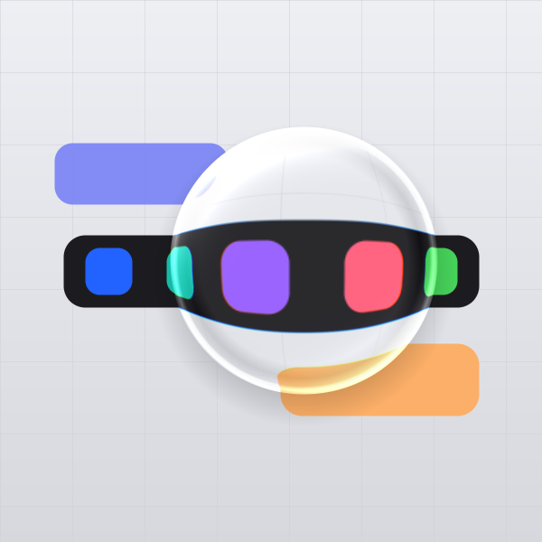

# Liquid Glass — interactive refraction lens (300 × 300)

A draggable circular **liquid glass lens** that refracts and magnifies whatever
is behind it — grid, text, color chips — with a specular rim highlight,
chromatic fringing at the edge, and a soft drop shadow. The Apple "Liquid Glass"
look as a real, interactive web widget.



## Run it

Just open `index.html` in a browser (Chrome/Safari/Edge). No build, no server.

- **Drag** the glass anywhere over the scene.
- **Double-click** to toggle the idle auto-float.

## Files

| File              | What it is                                                              |
|-------------------|-------------------------------------------------------------------------|
| `index.html`      | The 300×300 interactive widget (canvas + pointer/touch dragging)        |
| `lens.js`         | The refraction math — **shared** by the widget and the preview renderer |
| `render_lens.js`  | Dependency-free Node script that renders `preview.png` using `lens.js`  |
| `preview.png`     | Still produced by `render_lens.js` (600×600 = the 300×300 design at 2x) |

Because the browser widget and the offline preview call the **same `lens.js`**,
the still you see above is an accurate preview of the live result.

```bash
node render_lens.js   # regenerate preview.png
```

## How the lens works (`lens.js`)

For every pixel inside the circle it samples the background along the radial
direction, remapping the radius so the centre **magnifies** and the rim
**compresses** (continuous at the edge, so there's no seam):

```js
srcRadius(nr) = nr*mag + nr^5 * (1 - mag)   // mag < 1  => magnification
```

On top of that it adds:

- **Chromatic aberration** — red/blue sampled at slightly different radii, growing toward the rim.
- **Specular highlights** — a bright crescent on the light-facing rim, a softer one opposite, and a thin bright ring.
- **Inner contact shadow** — a hint of glass thickness just inside the edge.
- **Anti-aliased alpha** at the circle boundary.

### Tuning

In `index.html` / `render_lens.js` pass options to `LiquidLens.render(..., opts)`:

| Option  | Default | Effect                                  |
|---------|---------|-----------------------------------------|
| `mag`   | `0.62`  | Lower = stronger magnification          |
| `ca`    | `0.018` | Chromatic aberration strength           |
| `frost` | `0.06`  | Milky tint mixed into the refraction    |

Lens size is the `R` constant; the background scene is drawn in `drawScene()`.
